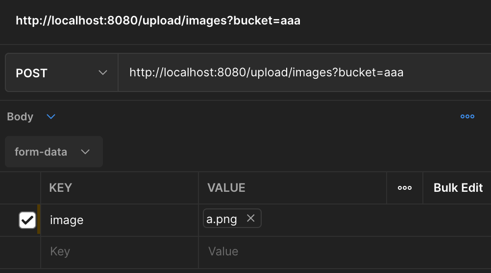

# local-object-storage

## リポジトリ概要

#### 使用方法
##### 1. MinIO起動
```cassandraql
docker-compose up -d
```

##### MinIOの状況確認方法

connect monio
```
http://localhost:9090/
```

##### 2. proxy(API)を起動
```cassandraql
go run cmd/main.go
```
default running port is 8080.

### 各エンドポイント

**EndPoints**

|  EndPoint | Methods | Discribe                                            |
| ---- |---------|-----------------------------------------------------|
|  read/bucket  | GET     | Check the existing bucket.                          |
|  create/bucket | POST    | Create a bucket.                                    |
| upload/images |   POST    | Upload the image. (Only png and jpg are supported.) |

- read/bucket：存在するバケットのリストを確認する
- create/bucket：バケットを作成する
- upload/images：画像をMinIOへ保存する
 
※バケット：画像を保存するため入れもの(フォルダ同じだものと考えてOK)

#### 各エンドポイントのリクエスト例
- read/bucket：存在するバケットのリストを確認する  
**リクエストを送るのみ**

- create/bucket：バケットを作成する  
  **リクエストボディ**
```cassandraql
{
    "Name": "aaa" 
}
```
※Nameは3文字以上

- upload/images：画像をMinIOへ保存する  
  **クエリパラメーター**  
key：bucket
※bucketはすでに存在しているバケットの名前である必要がある

  **リクエストボディ(multipart/form-data)**  
  key：image  
  value：任意の画像


